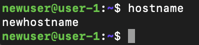
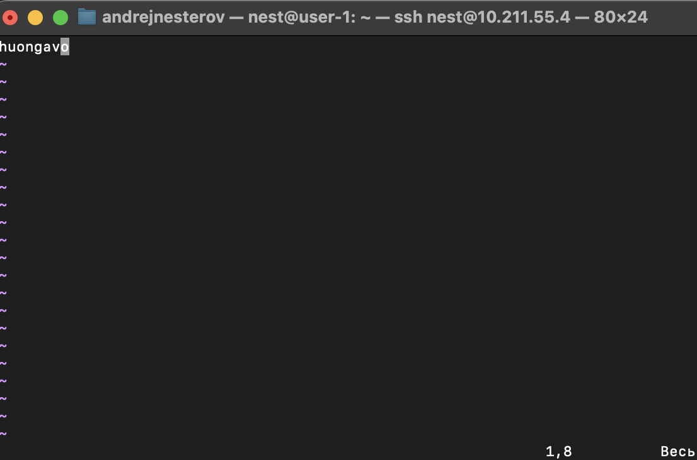
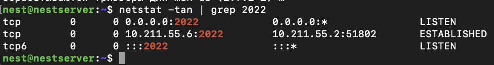
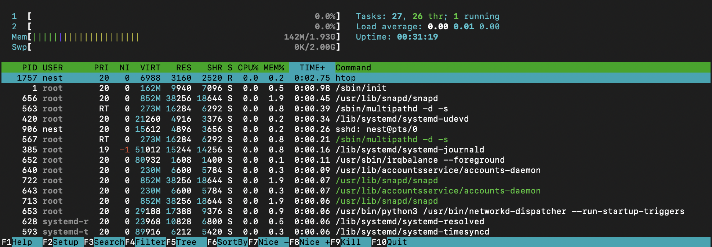

##Операционные системы UNIX/Linux (Базовый)
Краткое вступление описывающее содержание файла и цели заданий.

# Задание 1: Установить Ubuntu 20.04 Server LTS без графического интерфейса.
* Установка системы без графического интерфейса. 
* Использована программа *ParallesDesktop*, в связи с тем, что VB рне хочет работать на компьютере с процессом *m1*.
* Использована одна команда:
1 - **cat /etc/issue**

# Задание 2: Создание пользователя
* Создан пользователь *newuser*
* пользователю *newuser* выданы права *adm*
* использовано три команды:
1 - **sudo adduser**
2 - **sudo usermod -aG adm**
3 - **cat /etc/passwd**

# Задание 3: Настройка сети ОС

## Часть 1: Задать название машины вида user-1
Ипользовано две команды: 
1 - **sudo hostnamectl set-hostname** 
2 - **hostnamectl status** 

## Часть 2: Установить временную зону, соответствующую вашему текущему местоположению.
Ипользовано две команды: 
1 -**sudo timedatectl set-timezone** 
2- **timedatectl** 

## Часть 3: Вывести названия сетевых интерфейсов с помощью консольной команды.
Использована одна команда:
**ip link**

**lo** - это **loopback** интерфейс, используемый для внутреннего IP-трафика системы. Он представляет собой виртуальный сетевой интерфейс, который используется системой для связи с самой собой. Тоже самое что и 127.0.0.1 или localhost. Можно использовать для тестирования веб сервисов или сайтов, на домашнем(локальном) компьютере. 

## Часть 4: Используя консольную команду получить ip адрес устройства, на котором вы работаете, от DHCP сервера
Использована одна команда:
**ip addr show**

**DHCP (Dynamic Host Configuration Protocol)** — это протокол, который автоматически назначает IP-адреса устройствам в сети, позволяя им связываться в сети без необходимости ручной настройки.

## Часть 5: Определить и вывести на экран внешний ip-адрес шлюза (ip) и внутренний IP-адрес шлюза, он же ip-адрес по умолчанию (gw)
Использована одна команда:
**ip route**
Получили внутренний **ip** адрес шлюза.

Использована одна команда:
**curl ifconfig.me**
Получили внешний **ip** адрес шлюза.

## Часть 6: Задать статичные (заданные вручную, а не полученные от DHCP сервера) настройки ip, gw, dns (использовать публичный DNS серверы, например 1.1.1.1 или 8.8.8.8).
Ипользовано две команды: 
1 - **sudo nano /etc/netplan/00-installer-config.yaml**  открыл конфигурационный файл сетевого интерфейса enp0s5. 
2 - **sudo reboot**  - перезагрузка системы.  

1) - начальное состояние файла **00-installer-config.yaml**. 

2) - внесенные изменения.  

## Часть 7: Перезагрузить виртуальную машину. Убедиться, что статичные сетевые настройки (ip, gw, dns) соответствуют заданным в предыдущем пункте.
Ипользовано две команды: 
1 - **sudo nano /etc/netplan/00-installer-config.yaml**  открыл конфигурационный файл сетевого интерфейса enp0s5. 
2 - **sudo reboot**  - перезагрузка системы.  

1) - отчет **ip addr**

2) - отчет **ip route**

3) - отчет о используемых DNS

4) Успешно пропинговать удаленные хосты 1.1.1.1 и ya.ru

# Задание 4: Обновить системные пакеты до последней на момент выполнения задания версии
* Использованы три команды:
1 - **sudo apt update**
2 - **sudo apt upgrade**
3 - **sudo apt full-upgrade**

# Задание 5: Использование команды sudo: Обновить системные пакеты до последней на момент выполнения задания версии
* Использованы три команды:
1 - **sudo usermod -aG sudo name** выдаяа прав
2 - **sudo hostnamectl set-hostname new_hostname** смена названия
3 - **hostname** проверка названия

# Задание 6: Установка и настройка службы времени
* Использованы три команды:
1 - **sudo timedatectl set-ntp true** включение и синхронизация времени
2 - **timedatectl show** смена названия

# Задание 7: Установить текстовые редакторы VIM (+ любые два по желанию NANO, MCEDIT, JOE и т.д.)
* VIM:
1 - **vim test_VIM.txt** создание файла
2 - **:qw** выход с сохранением

1 - **vim test_VIM.txt** открытие файлы
2 - **:q!** выход без сохранения

 
1 - **vim test_VIM.txt** открытие файлы
2 - **:%s/huongavo/nest/g ** поиск и замена
3 - **:q!** выход без сохранения

* NANO:
1 - **nano test_NANO.txt** создание файла
2 - **contrl+o, contrl+x** выход с сохранением

1 - **nano test_NANO.txt** открытие файлы
2 - **contrl+x, n** выход без сохранения

 
1 - **nano test_NANO.txt** открытие файлы
2 - **contrl+w, contrl+r** поиск и замена
3 - **contrl+x,n** выход без сохранения

* JOE:
1 - **nvim test_NEOVIM.txt** создание файла
2 - **:qw** выход с сохранением

1 - **nvim test_NEOVIM.txt** открытие файлы
2 - **:q!** выход без сохранения

 
1 - **nano test_NANO.txt** открытие файлы
2 - **%s/huongavo/nest/g** поиск и замена
3 - **:qw** выход с сохранением

# Задание 8: Установка и базовая настройка сервиса SSHD
список команд:
* **sudo apt update** - обновление системы
* **sudo apt install openssh-server** - установка ssh сервера
* **sudo nano /etc/ssh/sshd_config** - смена порта на 2022, нужно еще раскоментировать. 

* **ps -e | grep sshd - ps**  ключ -e и фильтром grep для поиска процесса SSHd

* **sudo apt install net-tools**  установка утилиты для прослушивания портов
* **netstat -tan | grep 2022** проверка портов

Значение 0.0.0.0 в выводе команды означает, что служба слушает на всех доступных сетевых интерфейсах (все IP-адреса сервера). Если виден вывод с портом 2022 и LISTEN, это означает, что служба SSHd слушает на порту 2022.

-tan это:
-t: Этот ключ указывает netstat выводить только информацию о TCP-соединениях. 
-a: Этот ключ указывает netstat выводить информацию о всех активных соединениях, как слушающих (listening), так и установленных (established)
-n: Этот ключ указывает netstat не выполнять разрешение имен (DNS-резолюцию) для IP-адресов и портов.

# Задание 9: Установка и использование утилит top, htop
* Использованы три команды:
1 - **htop** запуск htop
полученные данные:
1) uptime: **00:25:35**
2) количество авторизованных пользователей: **1**
3) общую загрузку системы: **0.00, 0.07, 0.05**
4) общее количество процессов: **27**
5) загрузку cpu: **1.3%**
6) загрузку памяти: **0K/2.00G**
7) pid процесса занимающего больше всего памяти: **703**
8) pid процесса, занимающего больше всего процессорного времени: **1757**

PID: 

PERCENT_CPU:

PERCENT_MEM:

TIME:

Отфильтрованному для процесса sshd:

с процессом syslog, найденным, используя поиск:

с добавленным выводом hostname, clock и uptime:

# Задание 10: Использование утилиты fdisk
* Использованые команды:
* sudo fdisk -l

1) Название жесткого диска: /dev/sda
2) Размер жесткого диска: 64 Gi
3) Количество секторов жесткого диска: 134217728 секторов.

* **free -h**

4) размер swap: 2,0 Gi

# Задание 11: Использование утилиты df
* Использованые команды:
* **df**

1) Размер раздела: 65222220.
2) Размер занятого пространства: 4856084.
3) Размер свободного пространства: 57020628.
4) Процент использования: 8%.

* **df -Th**

1) Размер раздела: 63G (гигабайта).
2) Размер занятого пространства: 4,7G (гигабайта).
3) Размер свободного пространства: 55G (гигабайта).
4) Процент использования: 8%.
5) Тип файловой системы для раздела: ext4.

# Задание 12: Использование утилиты du
* Использованые команды:
* **du -sh /home**
* **sudo du -sh /var**
* **sudo du -sh /var/log**

* sudo du -sh /var/log/* 

# Задание 13: Установка и использование утилиты ncdu
* Использованые команды:
* **sudo apt install ncdu**
* **ncdu /home**

* **sudo ncdu /var**

* **sudo ncdu /var/log** 

# Задание 14: Установка и использование утилиты ncdu
* Использованые команды:
* **cat /var/log/auth.log**

> Nov 21 23:26:00 nestserver sshd[2243]: Accepted password for nest from 10.211.55.2 port 52184 ssh2
> Nov 21 23:26:00 nestserver sshd[2243]: pam_unix(sshd:session): session opened for user nest by (uid=0)
> Nov 21 23:26:00 nestserver systemd-logind[659]: New session 5 of user nest.
> Nov 21 23:26:00 nestserver systemd: pam_unix(systemd-user:session): session opened for user nest by (uid=0)

* **sudo systemctl restart sshd**
* **cat /var/log/auth.log**

> Nov 21 23:29:03 nestserver sudo:     nest : TTY=pts/0 ; PWD=/home/nest ; USER=root ; COMMAND=/usr/bin/systemctl restart sshd
> Nov 21 23:29:03 nestserver sudo: pam_unix(sudo:session): session opened for user root by nest(uid=0)
> Nov 21 23:29:03 nestserver sshd[697]: Received signal 15; terminating.
> Nov 21 23:29:04 nestserver sshd[2395]: Server listening on 0.0.0.0 port 2022.
> Nov 21 23:29:04 nestserver sshd[2395]: Server listening on :: port 2022.
> Nov 21 23:29:04 nestserver sudo: pam_unix(sudo:session): session closed for user root

# Задание 15: Использование планировщика заданий CRON
* Использованые команды:
* **crontab -e** Откроем файл crontab для текущего пользователя:
* ** **/2 * * * * uptime** Добавим задачу в планировщике заданий. Эта строка запустит команду uptime каждые 2 минуты.

* **systemctl status cron** проверка статуса CRON и выполненых задач.

* **sudo journalctl -u cron -f** еще одна проверка работы крон, тут дважды в две минуты.

